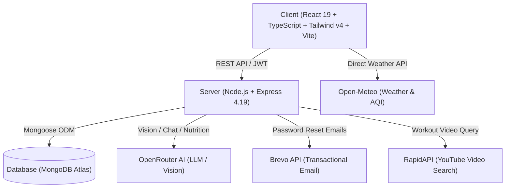

<div align="center">

# ⚡ FitTrack AI
### Intelligent Health, Nutrition & Fitness Operating System

[](https://react.dev/)
[](https://www.typescriptlang.org/)
[](https://tailwindcss.com/)
[](https://vitejs.dev/)
[](https://expressjs.com/)
[](https://www.mongodb.com/)
[](https://ai-fitness-tracker1.vercel.app)
[](LICENSE)

<p align="center">
  A full-stack, AI-powered health and fitness companion designed to transform daily habits into measurable progress. Featuring multimodal AI meal logging, real-time context-aware coaching, adaptive workout and meal planners, and a mobile-optimized interface.
</p>

[🚀 **Explore Live Demo**](https://ai-fitness-tracker1.vercel.app) • [✨ **Features**](#-features) • [📱 **Mobile View**](#-mobile-experience) • [🛠️ **Quick Start**](#-quick-start) • [📡 **API Reference**](#-api-reference)

---

</div>

## 🌟 Overview

**FitTrack AI** combines modern fitness tracking with generative artificial intelligence to deliver an experience that goes beyond standard calorie counting:

- **Intelligent Vision & NLP Logging:** Snap a photo or type a meal description; AI identifies foods and computes calories and macros automatically.
- **Context-Aware AI Coaching:** FitBot tracks your personal goals, daily calories consumed/burned, and past conversation context to provide personalized guidance.
- **Tailored Multi-Day Planners:** Custom meal schedules and multi-split activity routines created to match your schedule and fitness targets.
- **Mobile-First Experience:** Built with responsive bottom-dock navigation, edge-to-edge notch handling, and adaptive data cards for desktop and mobile screens.
- **Comprehensive Wellness Hub:** Includes YouTube workout streaming, Bhangra & gym pump playlists, real-time weather & Air Quality Index (AQI), and live fitness news.

---

## ✨ Features

### 🧠 1. Artificial Intelligence Core
- **FitBot Personal Coach (`/ai-assistant` & `/ai`):** Chat with a context-aware fitness assistant powered by OpenRouter LLMs. FitBot references your profile (weight, target calories, training goal) and remembers past sessions.
- **AI Food Snap (Vision Analysis):** Upload or capture a meal photo directly from your camera for instant dish recognition and nutritional estimation.
- **Smart Natural Language Nutrition Estimator:** Type `"Grilled salmon with brown rice and broccoli"` and receive automated calorie and macronutrient breakdowns (Protein, Carbs, Fat).
- **AI Workout Planner:** Generates 3, 5, or 7-day workout routines based on training focus (Fat Loss, Strength, Endurance, Balanced, Mobility), equipment, and fitness level.
- **AI Meal Planner:** Creates multi-day dietary plans with direct one-click meal addition into your daily Food Log.

### 📊 2. Health Analytics & Daily Tracking
- **Interactive Dashboard:** 
  - **Dynamic Goal Rings:** Real-time visual meters for Calories In, Calories Out, and Active Minutes that scale responsively for mobile and desktop screens.
  - **Activity Streak Engine:** Tracks consecutive daily logging milestones with confetti celebrations.
  - **Net Calorie Calculator:** Instant calculation of caloric balance (Eaten vs. Burned).
  - **Macro Breakdown:** Protein, Carbohydrate, and Fat distribution cards.
  - **Automated BMI Calculator:** Visual BMI classification and personalized target alerts.
- **Interactive Water Intake Tracker:** Visual hydration progress with quick-add presets (`+150ml`, `+250ml`, `+350ml`, `+500ml`) and custom volume input.
- **Filterable Date Selector:** Historic log inspection with date-by-date nutritional breakdown.

### 🏋️ 3. Workout Studio & Music Player
- **Curated Workout Categories:** Strength, Cardio, HIIT, Yoga, and Mobility.
- **In-App Video Streaming:** Embedded modal video player powered by the YouTube138 RapidAPI integration.
- **High-Energy Punjabi Gym Playlists:** Curated pump-up mixes (Diljit Dosanjh, AP Dhillon, Sidhu Moosewala, Karan Aujla, Shubh) tagged by BPM and mood (Hype, Pump, Warm-Up, Cool-Down).

### 🌤️ 4. Outdoor Weather & Health News
- **Live Weather & AQI:** Real-time temperature, wind, humidity, and Air Quality Index powered by Open-Meteo to plan safe outdoor training sessions.
- **Health & Wellness News Feed:** Live headlines curated from leading health publications via NewsAPI.
- **Curated Fitness Blog:** Informative fitness articles with search and category tags.

### 🔐 5. Security & Authentication
- **Secure JWT Auth:** Token-based authentication with encrypted password hashing via bcryptjs.
- **Google OAuth 2.0:** Single-tap Google sign-in.
- **Email-Based Password Recovery:** Expiring reset tokens delivered via Brevo's HTTPS transactional API.

---

## 📱 Mobile Experience

FitTrack AI features a dedicated mobile architecture designed for modern smartphones:

| Feature | Description |
|---|---|
| **Bottom Navigation Dock** | Quick-access tab bar (Home, Food, Activity, Workouts, AI Coach) fixed to the bottom with active micro-animations. |
| **Safe-Area Insets** | `viewport-fit=cover` and `.safe-area-pb` support to prevent clipping on iPhone dynamic islands and home indicators. |
| **Adaptive Goal Rings** | 3-column responsive goal rings that fit cleanly on compact mobile viewports without broken line wraps. |
| **Unified Mobile Drawer** | Slide-over drawer with user profile summary, one-tap theme toggle, and mobile logout functionality. |
| **Full-Height Chat Viewport** | Dynamic `100dvh` layout prevents mobile keyboards or bottom bars from hiding message history or the input bar. |

---

## 🛠️ Tech Stack



### Frontend Architecture
- **Framework:** React 19.2 with TypeScript ~5.9
- **Build Engine:** Vite 7.x
- **Design System:** Tailwind CSS v4
- **Routing:** React Router v7
- **Motion & Micro-interactions:** Framer Motion 12.x
- **Data Charts:** Recharts 3.x
- **Icons:** Lucide React
- **Notifications:** React Hot Toast

### Backend Architecture
- **Runtime:** Node.js `>=18.0.0`
- **Framework:** Express.js 4.19
- **Database & ODM:** MongoDB & Mongoose 8.x
- **Security:** Helmet, CORS, bcryptjs, JSON Web Tokens (JWT)
- **Media Ingestion:** Multer (multipart form handling for vision analysis)
- **External Providers:** OpenRouter, Brevo API, NewsAPI, RapidAPI

---

## 📁 Project Structure

```text
AI-FitnessTracker1/
├── client/                              # React + TypeScript Client
│   ├── public/
│   │   └── favicon.svg                  # Brand favicon
│   ├── src/
│   │   ├── Pages/                       # Route views
│   │   │   ├── Dashboard.tsx            # Analytics, rings, streak, water
│   │   │   ├── FoodLog.tsx              # Nutrition logging & AI food snap
│   │   │   ├── ActivityLog.tsx          # Exercise & calorie burn tracker
│   │   │   ├── AIAssistant.tsx          # FitBot AI chat interface
│   │   │   ├── Workouts.tsx             # Video library & Punjabi playlists
│   │   │   ├── MealPlanner.tsx          # Multi-day meal generator
│   │   │   ├── ActivityPlanner.tsx      # Multi-day workout generator
│   │   │   ├── Weather.tsx              # Live forecast & AQI
│   │   │   ├── Blog.tsx / BlogPost.tsx  # Fitness articles & news feed
│   │   │   ├── Profile.tsx              # User metrics & PDF export
│   │   │   ├── Login.tsx                # Auth form (Sign in / Sign up)
│   │   │   └── Onboarding.tsx           # Initial setup questionnaire
│   │   ├── components/
│   │   │   ├── BottomNav.tsx            # Mobile fixed bottom navigation dock
│   │   │   ├── Sidebar.tsx              # Responsive sidebar & mobile drawer
│   │   │   ├── Logo.tsx                 # Dynamic SVG animated logo
│   │   │   ├── DateDropdown.tsx         # Date selector component
│   │   │   └── ui/                      # Shared reusable UI primitives
│   │   ├── Context/
│   │   │   ├── AppContext.tsx           # Global user state & records
│   │   │   └── Themecontext.tsx         # Light/Dark mode state
│   │   ├── configs/
│   │   │   └── api.ts                   # Axios configuration
│   │   ├── App.tsx                      # Root routes & layout wrapper
│   │   └── index.css                    # Tailwind CSS v4 theme tokens
│   ├── index.html                       # HTML entry point (viewport-fit)
│   └── vite.config.ts                   # Vite configuration
│
└── server/                              # Express + MongoDB API
    ├── server.js                        # Server entry point
    └── src/
        ├── app.js                       # Express configuration & middleware
        ├── config/db.js                 # MongoDB connection
        ├── models/                      # Mongoose schemas (User, Food, Activity, Water, Blog, Chat)
        ├── controllers/                 # Business logic controllers
        ├── routes/                      # API endpoint definitions
        ├── middleware/                  # JWT auth, multer, error handlers
        └── services/                    # OpenRouter AI, Brevo email services
```

---

## 🚀 Quick Start

### Prerequisites
- **Node.js:** `>= 18.0.0`
- **npm:** `>= 8.0.0`
- **MongoDB:** Local MongoDB instance or a free [MongoDB Atlas](https://www.mongodb.com/atlas) cluster

### 1. Clone the Repository
```bash
git clone https://github.com/Jashan-randhawa/AI-FitnessTracker1.git
cd AI-FitnessTracker1
```

### 2. Configure & Run Backend Server
```bash
cd server
npm install

# Setup environment configuration
cp .env.example .env
```

Edit `server/.env` with your credentials:
```env
HOST=0.0.0.0
PORT=1337
NODE_ENV=development

# Database
MONGODB_URI=mongodb://127.0.0.1:27017/fittrack

# Security
JWT_SECRET=your_super_secret_random_jwt_key
JWT_EXPIRES_IN=30d

# AI & APIs
OPENROUTER_API_KEY=your_openrouter_api_key
NEWS_API_KEY=your_newsapi_key
RAPIDAPI_KEY=your_rapidapi_key

# OAuth & Mail
GOOGLE_CLIENT_ID=your_google_client_id
GOOGLE_CLIENT_SECRET=your_google_client_secret
GOOGLE_CALLBACK_URL=http://localhost:1337/api/connect/google/callback
BREVO_API_KEY=your_brevo_api_key
EMAIL_FROM="FitTrack AI <no-reply@fittrack.app>"

CLIENT_URL=http://localhost:5173
```

Start the server:
```bash
npm run dev
```
> Server will boot on `http://localhost:1337` and auto-seed initial blog data if empty.

### 3. Configure & Run Frontend Client
Open a new terminal window:
```bash
cd client
npm install
```

Create `client/.env`:
```env
VITE_STRAPI_API_URL=http://localhost:1337/
```

Launch the development server:
```bash
npm run dev
```
> Visit `http://localhost:5173` in your browser.

---

## 📡 API Reference

All requests requiring authorization must include the header:  
`Authorization: Bearer <JWT_TOKEN>`

### Authentication & User
| Method | Endpoint | Description | Access |
|---|---|---|---|
| `POST` | `/api/auth/local/register` | Register new user account | Public |
| `POST` | `/api/auth/local` | Authenticate with email & password | Public |
| `GET` | `/api/users/me` | Fetch authenticated profile details | Private |
| `PUT` | `/api/users/:id` | Update profile goals, height, weight | Private |
| `GET` | `/api/connect/google` | Initiate Google OAuth sign-in | Public |

### Nutrition & Food Logging
| Method | Endpoint | Description | Access |
|---|---|---|---|
| `GET` | `/api/foodlogs` | List all food entries for current user | Private |
| `POST` | `/api/foodlogs` | Create new food entry | Private |
| `DELETE` | `/api/foodlogs/:id` | Delete meal record | Private |

### Exercise & Activity Logging
| Method | Endpoint | Description | Access |
|---|---|---|---|
| `GET` | `/api/activitylogs` | List all workout logs | Private |
| `POST` | `/api/activitylogs` | Log new activity (duration, calories) | Private |
| `DELETE` | `/api/activitylogs/:id` | Delete activity record | Private |

### Water Intake
| Method | Endpoint | Description | Access |
|---|---|---|---|
| `GET` | `/api/waterlogs` | Fetch user water intake records | Private |
| `POST` | `/api/waterlogs` | Log water consumption (amount in ml) | Private |
| `DELETE` | `/api/waterlogs/:id` | Delete water entry | Private |

### Generative AI
| Method | Endpoint | Description | Access |
|---|---|---|---|
| `POST` | `/api/ai-assistant/chat` | Send message to FitBot Coach | Private |
| `POST` | `/api/image-analysis` | Analyze meal photo for nutrition | Private |
| `POST` | `/api/food-estimate` | Natural language text nutrition estimator | Private |
| `POST` | `/api/calorie-estimate` | Estimate calories burned from exercise | Private |

---

## 🚢 Deployment

### Frontend (Vercel)
1. Import the repository into [Vercel](https://vercel.com).
2. Set root directory to `client`.
3. Add Environment Variable:
   - `VITE_STRAPI_API_URL` = `https://your-backend-api-url.com/`
4. The repo includes `client/vercel.json` for SPA URL rewrites:
   ```json
   { "rewrites": [{ "source": "/(.*)", "destination": "/" }] }
   ```

### Backend (Render / Railway / Fly.io / VPS)
1. Deploy `server/` to any Node.js host.
2. Ensure Node.js version is `>=18.0.0`.
3. Set all required environment variables in the host dashboard.
4. Set start command: `npm start`.

---

## 🤝 Contributing

Contributions are welcome! To get started:

1. **Fork** the repository.
2. **Create a branch:** `git checkout -b feature/amazing-feature`.
3. **Commit your changes:** `git commit -m "feat: add amazing feature"`.
4. **Push to branch:** `git push origin feature/amazing-feature`.
5. **Open a Pull Request**.

---

## 📄 License

Distributed under the **MIT License**. See `LICENSE` for more information.

---

<div align="center">
  <sub>Built with ❤️ by <a href="https://github.com/Jashan-randhawa">Jashan Randhawa</a></sub>
</div>
