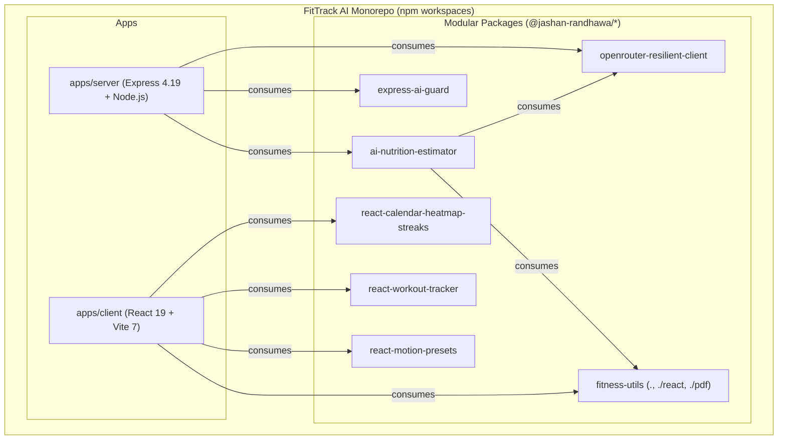

<div align="center">

# ⚡ FitTrack AI
### Intelligent Health, Nutrition & Fitness Monorepo & Ecosystem

[](https://github.com/Jashan-randhawa/AI-FitnessTracker1/actions/workflows/ci.yml)
[](#-testing--cicd)
[](#-modular-packages)
[](https://github.com/changesets/changesets)
[](https://react.dev/)
[](https://www.typescriptlang.org/)
[](https://tailwindcss.com/)
[](https://vitejs.dev/)
[](https://expressjs.com/)
[](https://nodejs.org/)
[](https://www.mongodb.com/)
[](LICENSE)

<p align="center">
  A full-stack, AI-powered health and fitness ecosystem structured as a modern npm workspaces monorepo. Featuring full applications (web client and API server) alongside 7 standalone, production-tested, reusable npm packages.
</p>

[🚀 **Explore Live Demo**](https://ai-fitness-tracker1.vercel.app) • [📦 **Modular Packages**](#-modular-packages) • [✨ **Features**](#-features) • [🧪 **Testing & CI**](#-testing--cicd) • [🛠️ **Quick Start**](#-quick-start) • [📡 **API Reference**](#-api-reference)

---

</div>

## 🌟 Overview

**FitTrack AI** combines modern fitness tracking with generative artificial intelligence. Structured as an **npm workspaces monorepo**, the repository hosts both full-stack applications and a suite of decoupled, independent npm packages under the `@jashan-randhawa/` scope:

- **Intelligent Vision & NLP Logging:** Snap a photo or type a meal description; AI identifies foods and computes calories and macros automatically.
- **Context-Aware AI Coaching:** FitBot tracks personal goals, daily calories consumed/burned, and past conversation context to provide personalized guidance.
- **Interactive Calendar Heatmaps:** GitHub-style 90-day activity and nutrition heatmaps with intensity scaling, streak tracking, and instant date navigation.
- **Tailored Multi-Day Planners:** Custom meal schedules and multi-split activity routines created to match your schedule and fitness targets.
- **Hardened Security & Rate Limiting:** Protected with dual-tier rate limiters, strict AI payload caps, secure fragment-based Google OAuth, and anti-enumeration password resets.
- **Mobile-First Experience:** Built with responsive bottom-dock navigation, edge-to-edge notch handling, and adaptive data cards for desktop and mobile screens.
- **Decoupled Package Architecture:** 7 independent, fully tested npm libraries published under `@jashan-randhawa/` with dual ESM/CJS builds and strict TypeScript types.

---

## 📦 Modular Packages

Each package in `packages/` is completely standalone, fully typed, tested with Vitest, and configured for publishing to npm with [Changesets](https://github.com/changesets/changesets).

| Package | Version | Description | Target |
|---|---|---|---|
| [`@jashan-randhawa/openrouter-resilient-client`](packages/openrouter-resilient-client) | `1.0.0` | Resilient OpenRouter LLM client with automated fallback model failover, exponential backoff with jitter on 429/5xx/timeouts, and structured JSON parsing. | Universal / Node.js |
| [`@jashan-randhawa/express-ai-guard`](packages/express-ai-guard) | `1.0.0` | Production-grade Express middleware: dual-tier rate limiting (IP + authenticated user ID), request ID tracing, secret scrubber, and production error masking. | Express / Node.js |
| [`@jashan-randhawa/react-calendar-heatmap-streaks`](packages/react-calendar-heatmap-streaks) | `1.0.0` | Generic GitHub/contribution-style heatmap component with customizable 4-level color scales, timezone-safe date calculations, and streak tracking. | React 18 / 19 |
| [`@jashan-randhawa/react-workout-tracker`](packages/react-workout-tracker) | `1.0.0` | Headless `useWorkoutSession` hook and UI components (`WorkoutTracker`, `WorkoutSetRow`, `RestCountdownTimer`, `LiveWorkoutTrackerModal`) with volume math and confetti. | React 18 / 19 |
| [`@jashan-randhawa/react-motion-presets`](packages/react-motion-presets) | `1.0.0` | Framer Motion animation presets, stagger containers, `AnimatedNumber`, `StreamingWordReveal`, and accessible `CollapsibleCard` with reduced motion support. | React 18 / 19 |
| [`@jashan-randhawa/fitness-utils`](packages/fitness-utils) | `1.0.0` | Multi-entrypoint fitness toolkit: `.` (BMI, BMR, TDEE, macros, MET calories, CSV), `./react` (Web Audio chime & STT/TTS hooks), `./pdf` (multi-page PDF report). | Universal / React |
| [`@jashan-randhawa/ai-nutrition-estimator`](packages/ai-nutrition-estimator) | `1.0.0` | Multimodal nutrition engine supporting NLP text prompts, multi-dish vision image analysis, MET exercise burn, 5-min TTL cache, and medical disclaimers. | Universal / Node.js |

### Package Installation Example

```bash
# Install the resilient OpenRouter client
npm install @jashan-randhawa/openrouter-resilient-client

# Install React UI animations
npm install @jashan-randhawa/react-motion-presets framer-motion

# Install the fitness calculation utilities
npm install @jashan-randhawa/fitness-utils
```

---

## 🛠️ Monorepo Architecture


```mermaid
graph TD
    subgraph Monorepo ["FitTrack AI Monorepo (npm workspaces)"]
        subgraph Apps ["Apps"]
            Client["apps/client (React 19 + Vite 7)"]
            Server["apps/server (Express 4.19 + Node.js)"]
        end

        subgraph Packages ["Modular Packages (@jashan-randhawa/*)"]
            P1["openrouter-resilient-client"]
            P2["express-ai-guard"]
            P3["react-calendar-heatmap-streaks"]
            P4["react-workout-tracker"]
            P5["react-motion-presets"]
            P6["fitness-utils (., ./react, ./pdf)"]
            P7["ai-nutrition-estimator"]
        end
    end

    Server -->|consumes| P1
    Server -->|consumes| P2
    Server -->|consumes| P7
    P7 -->|consumes| P1
    P7 -->|consumes| P6

    Client -->|consumes| P3
    Client -->|consumes| P4
    Client -->|consumes| P5
    Client -->|consumes| P6
```

---

## ✨ Features

### 🧠 1. Artificial Intelligence Core
- **FitBot Personal Coach (`/ai-assistant` & `/ai`):** Chat with a context-aware fitness assistant powered by OpenRouter LLMs. FitBot references user profile metrics (weight, target calories, training goal) and past conversation context.
  - **Hands-Free Voice Experience:** Integrated Speech-to-Text (STT) for hands-free queries, plus Text-to-Speech (TTS) read-aloud playback via the Web Speech API.
  - **Dynamic Input & Stop Controls:** Auto-resizing textarea with instant generation abortion via `AbortController`.
  - **Rich Markdown Tables & Collapsible Cards:** Native rendering of markdown tables for multi-day workout splits and macro breakdowns, along with interactive collapsible plan cards.
  - **Resilience & Inline Error Retry:** Automatic fallback, retry on 429/5xx, and inline chat retry button for immediate one-click prompt re-dispatch.
  - **One-Click Export & Clipboard:** Download full workout and nutrition plans as formatted Markdown files or copy specific messages with checkmark confirmation.
  - **Audio Completion Cue:** Gentle dual-tone Web Audio API completion chime with quick mute/unmute header toggle.
- **Resilient AI Architecture & Transient Retries:** Integrated exponential backoff retry mechanism (1–2 retries) on network timeouts, provider hiccups, and 429/5xx status codes via `@jashan-randhawa/openrouter-resilient-client`.
- **Automated Model Fallback (`OPENROUTER_FALLBACK_MODEL`):** Automatic failover to secondary fallback models (e.g., Gemini 2.0 Flash) if the primary model (`openai/gpt-4o-mini`) is temporarily unavailable.
- **Dual-Tier Rate Limiting:** 30 req/min per IP (`aiLimiter`) plus 20 req/min per authenticated user (`aiUserLimiter`) keyed on `req.user.id` via `@jashan-randhawa/express-ai-guard`.
- **Structured JSON Validation & Repair Retry:** Automated parse verification and repair retry on Activity Planner and Meal Planner calls.
- **In-Memory Query Cache:** 5-minute short-TTL caching on identical prompt hashes, saving API credits and accelerating repeat advice queries.
- **AI Food Snap (Vision Analysis):** Upload or capture a meal photo directly from your camera for instant dish recognition and nutritional estimation via `@jashan-randhawa/ai-nutrition-estimator`.
- **Smart Natural Language Nutrition Estimator:** Type `"Grilled salmon with brown rice and broccoli"` and receive automated calorie and macronutrient breakdowns.

### 📊 2. Health Analytics & Daily Tracking
- **Interactive Dashboard:** 
  - **Dynamic Goal Rings:** Real-time visual meters for Calories In, Calories Out, and Active Minutes that scale responsively for mobile and desktop screens.
  - **Activity Streak Engine:** Tracks consecutive daily logging milestones with confetti celebrations.
  - **Net Calorie Calculator:** Instant calculation of caloric balance (Eaten vs. Burned) powered by `@jashan-randhawa/fitness-utils`.
  - **Macro Breakdown:** Protein, Carbohydrate, and Fat distribution cards.
  - **Automated BMI Calculator:** Visual BMI classification and personalized target alerts.
- **Interactive Calendar Heatmap (`@jashan-randhawa/react-calendar-heatmap-streaks`):**
  - Contribution-style activity and nutrition heatmap embedded in both **Food Log** and **Activity Log**.
  - 4-level color intensity scaling based on daily calories consumed or burned.
  - Streak tracking (current & max streak), interactive day selection, and tooltip summaries for past 90 days.
- **Interactive Water Intake Tracker:** Visual hydration progress with quick-add presets (`+150ml`, `+250ml`, `+350ml`, `+500ml`) and custom volume input.
- **Filterable Date Selector:** Historic log inspection with date-by-date nutritional breakdown.
- **Data Exports (PDF, CSV & PNG):**
  - **Formatted PDF Report:** Multi-page PDF report with stats summary, profile metrics, food logs, and activity records powered by `@jashan-randhawa/fitness-utils/pdf`.
  - **Raw CSV Spreadsheets:** RFC 4180 compliant comma-separated records of food and activity history via `@jashan-randhawa/fitness-utils`.
  - **PNG Progress Card:** Shareable visual progress cards generated client-side with html2canvas.

### 🏋️ 3. Workout Studio & Music Player
- **Curated Workout Categories:** Strength, Cardio, HIIT, Yoga, and Mobility.
- **Live Workout Tracker (`@jashan-randhawa/react-workout-tracker`):** Interactive modal for logging sets, reps, weight, and automated rest countdowns with confetti animations.
- **In-App Video Streaming:** Embedded modal video player powered by YouTube search (authenticated & rate-limited via backend proxy).
- **High-Energy Punjabi Gym Playlists:** Curated pump-up mixes (Diljit Dosanjh, AP Dhillon, Sidhu Moosewala, Karan Aujla, Shubh) tagged by BPM and mood.

### 🌤️ 4. Outdoor Weather & Health News
- **Live Weather & AQI:** Real-time temperature, wind, humidity, and Air Quality Index powered by Open-Meteo.
- **Health & Wellness News Feed:** Live headlines curated from leading health publications via NewsAPI.
- **Curated Fitness Blog:** Informative fitness articles with search and category tags.

### 🔐 5. Security & Authentication Hardening
- **Zero-Vulnerability Security Baseline:** Continuous dependency audits with `npm audit` ensuring 0 known vulnerabilities.
- **Secure JWT Auth:** Stateless token-based authentication with encrypted password hashing via bcryptjs.
- **IP & User Rate Limiting:** Enforced via `@jashan-randhawa/express-ai-guard` on auth, password reset, AI endpoints, and proxy routes.
- **Secure Google OAuth 2.0:** Tokens transferred via URL fragment (`#access_token=`) and exchanged over POST body to prevent token leakage.
- **Anti-Enumeration Password Recovery:** Uniform responses across all scenarios to eliminate timing or oracle leaks.
- **Production Error Masking:** All database errors and unhandled exceptions are masked with generic client messages in production.

---

## 🧪 Testing & CI/CD

### Monorepo Test Suite (91 Tests)

```bash
# Run all tests across packages and apps
npm test

# Run package unit tests only (Vitest)
npm run test:packages

# Run server unit tests only (node --test)
npm run test --workspace=server
```

| Suite | Runner | Tests | Coverage |
|---|---|---|---|
| **Packages (`packages/*`)** | Vitest | **56 Passing** | Retries, fallback failover, token parsing, dual limiters, request IDs, error masking, date heatmaps, streak grace period, workout sets, motion hooks, BMI/MET math, CSV escaping, nutrition estimator |
| **Server (`apps/server`)** | `node --test` | **35 Passing** | Auth & JWT, AI assistant payload caps, OpenRouter resilience, structured logger & scrubber, health checks, error handler, calorie estimates, password reset |
| **Total** | | **91 Passing** | **0 failures** |

### Continuous Integration (GitHub Actions)
- [`.github/workflows/ci.yml`](.github/workflows/ci.yml): Validates every PR and commit:
  - TypeScript compilation and dual ESM/CJS builds for all 7 packages.
  - Vitest test suite for packages.
  - `node --test` test suite for `apps/server`.
  - Vite production build (`tsc -b` + Vite) for `apps/client`.
- [`.github/workflows/release.yml`](.github/workflows/release.yml): Automated publishing pipeline with Changesets and npm provenance:
  - Triggered on push to `main`.
  - Creates Version PR or publishes packages to npm when merged.

---

## 📁 Monorepo Structure

```text
AI-FitnessTracker1/
├── .changeset/                          # Changesets configuration & release entries
├── .github/
│   └── workflows/
│       ├── ci.yml                       # CI matrix testing all packages & apps
│       └── release.yml                  # Changesets npm publication workflow
│
├── apps/
│   ├── client/                          # React 19 + TypeScript + Vite 7 Web Application
│   │   ├── src/
│   │   │   ├── Pages/                   # Application route views (Dashboard, Logs, AI, Workouts)
│   │   │   ├── components/              # UI components (CalendarHeatmap, AnimatedNumber, etc.)
│   │   │   ├── Context/                 # App and Theme React Contexts
│   │   │   └── App.tsx                  # App root & route registration
│   │   ├── package.json
│   │   └── vite.config.ts
│   │
│   └── server/                          # Express.js + MongoDB API Service
│       ├── src/
│       │   ├── controllers/             # Express controllers
│       │   ├── middleware/              # Auth, rate limiting, error handling, request ID
│       │   ├── models/                  # Mongoose data models
│       │   ├── routes/                  # Express route routers
│       │   └── services/                # OpenRouter client, estimation services, email
│       ├── test/                        # Native node --test suite (35 tests)
│       └── package.json
│
├── packages/                            # Decoupled, reusable npm packages
│   ├── ai-nutrition-estimator/          # Multimodal nutrition analysis engine
│   ├── express-ai-guard/                # Express AI rate limiting & security middleware
│   ├── fitness-utils/                   # Core math, ./react hooks, ./pdf export
│   ├── openrouter-resilient-client/     # OpenRouter client with fallback & retry
│   ├── react-calendar-heatmap-streaks/  # Contribution-style heatmap & streaks
│   ├── react-motion-presets/            # Framer Motion animations & accessibility
│   └── react-workout-tracker/           # Workout sets tracking hook & modal UI
│
├── CONTRIBUTING.md                      # Monorepo development & contribution guide
├── package.json                         # Root workspaces manifest & scripts
├── tsconfig.base.json                   # Shared root TypeScript configuration
└── LICENSE                              # MIT License
```

---

## 🚀 Quick Start

### Prerequisites
- **Node.js:** `>= 20.0.0`
- **npm:** `>= 8.0.0`
- **MongoDB:** Local instance or [MongoDB Atlas](https://www.mongodb.com/atlas) cluster

### 1. Clone & Install Monorepo
```bash
git clone https://github.com/Jashan-randhawa/AI-FitnessTracker1.git
cd AI-FitnessTracker1

# Install dependencies across all workspaces with a single command
npm install
```

### 2. Build All Packages & Applications
```bash
# Builds all 7 packages (tsup) and the client app (vite)
npm run build
```

### 3. Run Automated Tests
```bash
# Executes all 91 tests across packages and server
npm test
```

### 4. Configure & Start Applications

#### Configure Server
```bash
cd apps/server
cp .env.example .env
```

Edit `apps/server/.env`:
```env
HOST=0.0.0.0
PORT=1337
NODE_ENV=development
MONGODB_URI=mongodb://127.0.0.1:27017/fittrack
JWT_SECRET=your_super_secret_random_jwt_key
OPENROUTER_API_KEY=your_openrouter_api_key
```

Start the backend:
```bash
npm run dev --workspace=server
# Or from root: npm run dev:server
```

#### Configure Client
Edit `apps/client/.env`:
```env
VITE_API_URL=http://localhost:1337
```

Start the frontend:
```bash
npm run dev --workspace=client
# Or from root: npm run dev:client
```
> Visit `http://localhost:5173` in your browser.

---

## 🚢 Publishing Packages to npm

This repository uses [Changesets](https://github.com/changesets/changesets) for automated package versioning and publishing.

### Creating a Changeset
Whenever you make changes to any package in `packages/`:
```bash
npm run changeset
```
Follow the interactive prompt to select the affected packages, bump type (`patch`, `minor`, `major`), and provide a change summary.

### Publishing Releases
When merged into `main`, GitHub Actions ([`.github/workflows/release.yml`](.github/workflows/release.yml)) will automatically open a "Version Packages" PR. Merging that PR will publish the new versions to npm with provenance:
```bash
# Manual publish command (requires NPM_TOKEN with publish permissions):
npm run release
```

---

## 📡 API Reference

All requests requiring authorization must include the header:  
`Authorization: Bearer <JWT_TOKEN>`

### Authentication & User
| Method | Endpoint | Description | Rate Limit | Access |
|---|---|---|---|---|
| `POST` | `/api/auth/local/register` | Register new user account | 5 req / 15m | Public |
| `POST` | `/api/auth/local` | Authenticate with email & password | 5 req / 15m | Public |
| `GET` | `/api/users/me` | Fetch authenticated profile details | — | Private |
| `PUT` | `/api/users/:id` | Update profile goals, height, weight | — | Private |
| `GET` | `/api/connect/google` | Initiate Google OAuth sign-in | — | Public |
| `POST` | `/api/password-reset/request` | Request password reset email | 3 req / 1h | Public |
| `POST` | `/api/password-reset/reset` | Reset password using valid token | 3 req / 1h | Public |

### Nutrition & Food Logging
| Method | Endpoint | Description | Rate Limit | Access |
|---|---|---|---|---|
| `GET` | `/api/foodlogs` | List all food entries for current user | — | Private |
| `POST` | `/api/foodlogs` | Create new food entry | — | Private |
| `DELETE` | `/api/foodlogs/:id` | Delete meal record | — | Private |

### Exercise & Activity Logging
| Method | Endpoint | Description | Rate Limit | Access |
|---|---|---|---|---|
| `GET` | `/api/activitylogs` | List all workout logs | — | Private |
| `POST` | `/api/activitylogs` | Log new activity (duration, calories) | — | Private |
| `DELETE` | `/api/activitylogs/:id` | Delete activity record | — | Private |

### Water Intake
| Method | Endpoint | Description | Rate Limit | Access |
|---|---|---|---|---|
| `GET` | `/api/waterlogs` | Fetch user water intake records | — | Private |
| `POST` | `/api/waterlogs` | Log water consumption (amount in ml) | — | Private |
| `DELETE` | `/api/waterlogs/:id` | Delete water entry | — | Private |

### System & Health Monitoring
| Method | Endpoint | Description | Rate Limit | Access |
|---|---|---|---|---|
| `GET` | `/api/health` | Uptime health check (MongoDB status, process uptime, timestamp) | — | Public |

### Generative AI & Media
| Method | Endpoint | Description | Rate Limit | Access |
|---|---|---|---|---|
| `POST` | `/api/ai-assistant/chat` | Send message to FitBot Coach (with model fallback & retry) | 30 req/m (IP) + 20 req/m (User) | Private |
| `POST` | `/api/image-analysis` | Analyze meal photo for nutrition | 30 req / 1m | Private |
| `POST` | `/api/food-estimate` | Natural language text nutrition estimator | 30 req / 1m | Private |
| `POST` | `/api/calorie-estimate` | Estimate calories burned from exercise | 30 req / 1m | Private |
| `GET` | `/api/youtube/search` | Search workout videos via RapidAPI proxy | 30 req / 1m | Private |

---

## 📄 License

Distributed under the **MIT License**. See [`LICENSE`](LICENSE) for more information.

---

<div align="center">
  <sub>Built with ❤️ by <a href="https://github.com/Jashan-randhawa">Jashan Randhawa</a></sub>
</div>
