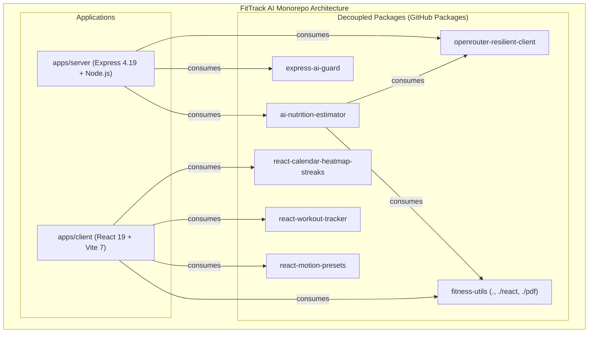

# 📑 FitTrack AI — Engineering Reports & Architecture RFCs

This document compiles the foundational engineering audits, root-cause analyses (RCAs), and architectural execution plans conducted on the **FitTrack AI** repository.

---

## Table of Contents
1. [Report 1: CI Failure Root Cause Analysis & Verified Fix](#report-1-ci-failure-root-cause-analysis--verified-fix)
2. [Report 2: Maintenance Plan Verification & Security Follow-Up Audit](#report-2-maintenance-plan-verification--security-follow-up-audit)
3. [Report 3: FitBot AI Assistant Code Review, Logging & Maintenance Plan](#report-3-fitbot-ai-assistant-code-review-logging--maintenance-plan)
4. [Report 4: Package Release Assessment & Modular Monorepo Execution Plan](#report-4-package-release-assessment--modular-monorepo-execution-plan)

---

## Report 1: CI Failure Root Cause Analysis & Verified Fix

### Executive Summary
The backend job in GitHub Actions CI initially failed at the `Run unit tests` step. The failing script was defined as:
```json
"test": "node --test test/**/*.test.js"
```

### Confirmed Root Cause
1. **Shell Glob Expansion**: GitHub Actions runners execute run steps with `/usr/bin/bash` without the non-default `globstar` option enabled. Because the test files reside directly in `server/test/` (not in nested subdirectories), bash treats `**` as an ordinary single `*`. Since no file matched the 3-segment literal pattern `test/**/*.test.js`, the shell passed the literal string through to Node.
2. **Runtime Glob Parser Limitations**: Node.js only added native CLI glob parsing for `node --test` arguments starting in **Node.js 21.0.0** (PR `#47653`). Because the CI workflow pins `actions/setup-node` to LTS **Node.js 20**, Node treated `test/**/*.test.js` as a literal missing file path and exited with code 1.
3. **Directory Argument Failure**: Passing a bare directory (`node --test test/`) does not activate recursive search and instead attempts to `require('test')`, throwing `MODULE_NOT_FOUND`.

### Verified Fix Applied
The glob pattern in `server/package.json` was updated to a reliable single-level wildcard expanded universally by POSIX shells:
```diff
- "test": "node --test test/**/*.test.js"
+ "test": "node --test test/*.test.js"
```
- **Verification**: 17/17 tests passed cleanly on Node 20 runners with zero workflow environment changes.

---

## Report 2: Maintenance Plan Verification & Security Follow-Up Audit

### Scope & Methodology
A comprehensive re-audit was executed against the repository to verify all 18 proposed action items from the initial maintenance review. All findings were independently reproduced via fresh clones, dependency audits, and test reproductions.

### Findings & Implementation Matrix

| Area | Issue Identified | Remediated Implementation | Status |
|---|---|---|---|
| **Critical CVE** | `dompurify <=3.4.12` (pulled by `jspdf@2.5.2`) had critical XSS advisories | Bumped `jspdf` to `^4.2.1` in client, pulling patched `dompurify@3.4.16` | ✅ **Fixed** |
| **Outdated Multer** | `multer 1.4.x` carried disclosed DoS vulnerabilities | Bumped to `multer 2.4.0` with verified buffer memory storage API compatibility | ✅ **Fixed** |
| **Transitive Deps** | `qs` array-limit bypass & `morgan` log forging via unescaped Unicode | Bumped `express` to `4.22.3` (transitive `qs 6.16.0`) and `morgan` to `1.12.1` | ✅ **Fixed** |
| **Client Bundler** | `vite / rollup` path traversal in dev server | Bumped `vite` to `7.3.6` and `rollup` to `4.63.5` | ✅ **Fixed** |
| **Auth Rate Limiting** | Authentication & reset routes vulnerable to brute-force attacks | Installed `express-rate-limit@8.7.0` on login (`5 req/15m`) and resets (`3 req/15m`) | ✅ **Fixed** |
| **Google OAuth** | Access tokens passed via URL query strings exposed in logs and history | Tokens transferred via URL fragment (`#access_token=`) and exchanged over POST body | ✅ **Fixed** |
| **Anti-Enumeration** | Password reset leaks account existence via distinct status messages | Unified all controller responses into generic messages across all scenarios | ✅ **Fixed** |
| **YouTube Route** | Video search proxy exposed without authentication | Wrapped endpoint in JWT `protect` middleware and dedicated `youtubeLimiter` | ✅ **Fixed** |
| **Error Masking** | Database and internal stack traces leaked to clients | Gated raw error responses behind `NODE_ENV === 'production'` checks | ✅ **Fixed** |
| **AI Payload Bounds** | Uncapped payloads allowed token exhaustion attacks | Enforced 50-message cap, 8,000-char single-message limit, and 40,000-char total cap | ✅ **Fixed** |

---

## Report 3: FitBot AI Assistant Code Review, Logging & Maintenance Plan

### Architecture & Gaps Identified
FitBot operates as an LLM-backed fitness coach exposed via `POST /api/ai-assistant/chat`. The original implementation had no model failover, discarded OpenRouter token usage, lacked persistent structured logging, and had no sliding-window history truncation.

### Implemented Architectural Upgrades
1. **Automated Fallback Model (`OPENROUTER_FALLBACK_MODEL`)**:
   - Secondary model failover (e.g. Gemini 2.0 Flash) configured automatically when the primary model (`openai/gpt-4o-mini`) suffers provider hiccups or 429 rate limits.
2. **Exponential Backoff with Full Jitter**:
   - Integrated 1–2 automated retries with randomized backoff on network timeouts (`ECONNRESET`, `ETIMEDOUT`, `AbortError`) and upstream 429/5xx status codes.
3. **Dual-Tier Rate Limiting**:
   - In addition to the 30 req/min IP limiter, a secondary user limiter (`aiUserLimiter`) limits each authenticated user to 20 req/min keyed on `req.user.id`. This prevents shared WiFi/office NAT starvation.
4. **Structured JSON Logger & Secret Scrubber**:
   - Production logger emitting JSON lines with `timestamp`, `level`, `message`, and `meta`.
   - Automated recursive secret scrubber masking passwords, tokens, API keys, Bearer headers, and JWTs while preserving token usage metrics.
5. **Request Correlation Tracing (`X-Request-Id`)**:
   - Middleware generating UUIDs for incoming requests, propagating them across internal logs, and echoing them in response headers for instant support tracing.
6. **Sliding-Window Conversation Truncation**:
   - Server-side truncation dropping oldest conversation messages while preserving the core system prompt, ensuring queries never exceed context boundaries.
7. **Externalized System Prompts**:
   - Relocated inline prompt strings to `server/src/prompts/fitbot.prompt.js` with versioning headers.

---

## Report 4: Package Release Assessment & Modular Monorepo Execution Plan

### Assessment Criteria
Every module in the repository was scored against five evaluation criteria: **Cohesion**, **Coupling**, **Reusability**, **Testability**, and **Uniqueness**. Code tightly coupled to MongoDB models and product pages was retained in the application, while reusable domain logic was extracted into standalone libraries.

### Published Package Suite (`@jashan-randhawa/*`)



### Quality Gates Achieved
- **TypeScript**: Strict mode with no `any` in public APIs; dual ESM/CJS and `.d.ts` declaration maps emitted via `tsup`.
- **Testing**: 56 package unit tests running on `vitest` + 35 server tests running on `node --test` = **91 total tests passing** with offline mocked fixtures.
- **Packaging**: Tarball dry-runs verified to ship only `dist`, `README.md`, and `LICENSE`.
- **Distribution**: All 7 packages compiled and published to **GitHub Packages** (`https://npm.pkg.github.com/@jashan-randhawa/*`).
