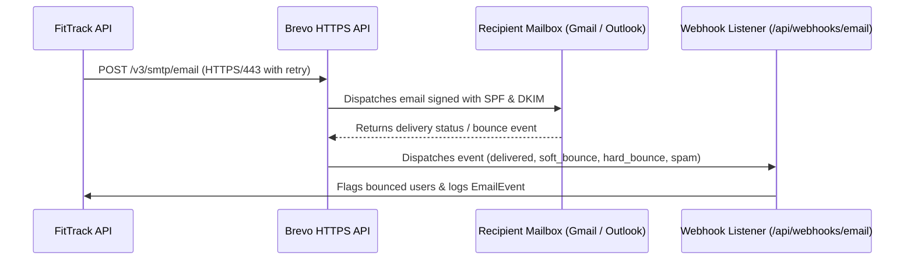

# 📧 Email Deliverability, SPF, DKIM & Webhook Setup

This guide details the steps required to ensure transactional password reset emails sent by **FitTrack AI** reliably reach user inboxes with 0% landing in spam.

---

## 🏗️ Architecture Overview

FitTrack AI sends transactional emails via **Brevo's HTTPS API** (`https://api.brevo.com/v3/smtp/email`) on port 443 instead of raw SMTP ports (25, 465, 587) to bypass cloud egress port blocking on hosts like Render.



---

## ⚙️ 1. Environment Configuration

In your server `.env` file:

```ini
# Brevo API Key from https://app.brevo.com (Settings → SMTP & API → API Keys)
BREVO_API_KEY=xkeysib-xxxxxxxxxxxxxxxxxxxxxxxxxxxxxxxxxxxx

# Verified sender address
EMAIL_FROM="AI Fitness Tracker <no-reply@yourdomain.com>"

# Frontend client base URL for reset links
CLIENT_URL=https://ai-fitness-tracker1.vercel.app
```

> [!NOTE]
> In local development (`NODE_ENV=development`), if `BREVO_API_KEY` is empty, reset links are printed directly to the console so developer testing requires no API credentials.

---

## 🛡️ 2. Domain DNS Authentication (SPF, DKIM, DMARC)

To prevent emails from landing in spam or being rejected by Gmail / Yahoo / Outlook:

### 2.1 SPF (Sender Policy Framework)
Add or update the TXT record on your root domain:

| Type | Host | Value |
|---|---|---|
| `TXT` | `@` | `v=spf1 include:spf.brevo.com ~all` |

### 2.2 DKIM (DomainKeys Identified Mail)
Brevo generates a dedicated DKIM public key pair for your domain.
In the Brevo Dashboard:
1. Navigate to **Senders & IP** → **Domains** → **Add a new domain**.
2. Copy the DKIM record provided by Brevo.
3. Add the TXT/CNAME record in your DNS provider (e.g. Cloudflare, Namecheap, Route53):

| Type | Host / Name | Value |
|---|---|---|
| `TXT` | `mail._domainkey` | `k=rsa; p=MIGfMA0GCSqGSIb3DQEBAQUAA4GNADCBiQ...` |

### 2.3 DMARC (Domain-based Message Authentication)
Add a TXT record to enforce DMARC compliance:

| Type | Host | Value |
|---|---|---|
| `TXT` | `_dmarc` | `v=DMARC1; p=quarantine; pct=100; rua=mailto:dmarc-reports@yourdomain.com` |

---

## 🔔 3. Webhook Setup for Bounce & Spam Suppression

FitTrack AI includes a built-in webhook listener at `POST /api/webhooks/email` to track delivery and automatically flag bad email addresses.

### Setting up in Brevo:
1. Go to **Settings** → **Webhooks** in the Brevo dashboard.
2. Click **Add a new webhook**.
3. Set URL to: `https://your-api-domain.com/api/webhooks/email`
4. Select events:
   - ✅ Delivered
   - ✅ Hard Bounce
   - ✅ Soft Bounce
   - ✅ Marked as Spam
   - ✅ Blocked
5. Save the webhook.

When a `hard_bounce` or `spam` complaint occurs:
- The user document in MongoDB is updated with `emailBounced: true`.
- An audit record is created in the `EmailEvent` collection.

---

## 🔄 4. Automated Retry & Failure Queue

The backend service [`server/src/services/email.service.js`](file:///server/src/services/email.service.js) includes automated exponential backoff:
- **Attempts**: 3 attempts (immediate, +1s, +3s).
- **Transient failures handled**: HTTP 429, 500, 502, 503, 504, network timeouts.
- **Permanent failure handling**: When all retries are exhausted, the event is saved to the `FailedEmail` MongoDB collection for manual administrator review.
