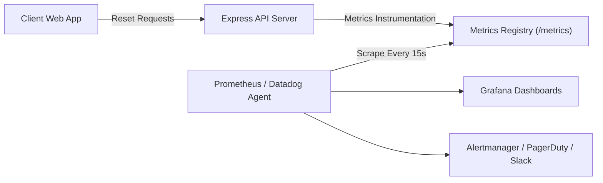

# 📊 Password Reset Monitoring, Metrics & Alerting Guide

This document details the observability architecture, Prometheus exposition metrics, Grafana dashboard panels, and alerting rules for the AI Fitness Tracker password recovery system.

---

## 1. Overview & Architecture

The password reset pipeline is instrumented with zero-overhead Prometheus-compatible metrics exposed at:
- `GET /metrics` (standard Prometheus scrape endpoint)
- `GET /api/metrics` (API gateway compatible endpoint)



---

## 2. Metrics Dictionary

All metrics are exposed in Prometheus standard text format with `# HELP` and `# TYPE` headers:

| Metric Name | Type | Labels | Description |
|---|---|---|---|
| `password_reset_requests_total` | Counter | `outcome="sent"|"rate_limited"|"locked"|"email_failed"` | Total password reset requests submitted |
| `password_reset_validations_total` | Counter | `outcome="valid"|"invalid"|"expired"|"locked"` | Total token validation checks |
| `password_reset_completions_total` | Counter | `outcome="success"|"invalid"|"expired"|"reuse_blocked"|"locked"` | Total password change submissions |
| `password_reset_email_dispatches_total` | Counter | `status="sent"|"failed"` | Total transactional emails attempted |
| `password_reset_email_failures_total` | Counter | `reason="brevo_4xx"|"brevo_5xx"|"network_error"` | Permanent email delivery failures by cause |
| `password_reset_email_duration_seconds` | Histogram | `le="0.1"|"0.25"|"0.5"|"1"|"2.5"|"5"|"10"|"+Inf"` | Latency of transactional email provider dispatches |
| `email_webhook_events_total` | Counter | `event="delivered"|"hard_bounce"|"soft_bounce"|"spam"` | Brevo delivery webhooks ingested |

---

## 3. Scrape Configuration (`prometheus.yml`)

Add the following scrape configuration to your Prometheus deployment:

```yaml
scrape_configs:
  - job_name: 'ai-fitness-tracker'
    scrape_interval: 15s
    scrape_timeout: 10s
    metrics_path: '/metrics'
    scheme: 'https'
    bearer_token: '${METRICS_TOKEN}' # configured in production
    static_configs:
      - targets: ['api.fittrack.app']
```

---

## 4. Production Prometheus Alert Rules (`alerts.yml`)

```yaml
groups:
  - name: password_reset_alerts
    rules:
      # 1. High Email Failure Rate
      - alert: PasswordResetEmailFailureRateHigh
        expr: |
          (
            sum(rate(password_reset_email_dispatches_total{status="failed"}[5m]))
            /
            sum(rate(password_reset_email_dispatches_total[5m]))
          ) * 100 > 10
        for: 5m
        labels:
          severity: critical
          tier: auth
        annotations:
          summary: "High password reset email failure rate (> 10%)"
          description: "Over 10% of reset emails failed to send over the last 5 minutes. Check Brevo API status or credits."

      # 2. Potential Credential Stuffing / Brute Force Surge
      - alert: PasswordResetBruteForceSurge
        expr: |
          sum(rate(password_reset_requests_total{outcome=~"rate_limited|locked"}[15m])) > 0.5
        for: 5m
        labels:
          severity: warning
          tier: security
        annotations:
          summary: "Abnormal surge in rate-limited or locked password reset requests"
          description: "Password reset rate-limits or lockouts exceeding 30/minute. Possible credential stuffing or denial-of-service attack."

      # 3. Broken Password Reset Flow (Zero Completions with Active Requests)
      - alert: PasswordResetFlowBroken
        expr: |
          sum(increase(password_reset_requests_total{outcome="sent"}[1h])) > 10
          and
          sum(increase(password_reset_completions_total{outcome="success"}[1h])) == 0
        for: 1h
        labels:
          severity: critical
          tier: auth
        annotations:
          summary: "Zero successful password resets in 1 hour despite incoming requests"
          description: "Users are requesting password resets but none are succeeding. Verify frontend routes and token verification endpoints."

      # 4. Elevated Email Latency
      - alert: PasswordResetEmailLatencyHigh
        expr: |
          histogram_quantile(0.95, sum(rate(password_reset_email_duration_seconds_bucket[5m])) by (le)) > 5
        for: 5m
        labels:
          severity: warning
          tier: infrastructure
        annotations:
          summary: "p95 email dispatch latency exceeds 5 seconds"
          description: "Brevo HTTPS API calls are taking longer than normal (> 5s). Investigate network egress latency."
```

---

## 5. Grafana Dashboard Specification

Create a new dashboard with the following 4 core panels:

### Panel 1: Password Reset Traffic & Funnel (Time Series)
- **Query A**: `sum by (outcome) (rate(password_reset_requests_total[5m]))`
- **Query B**: `sum by (outcome) (rate(password_reset_validations_total[5m]))`
- **Query C**: `sum by (outcome) (rate(password_reset_completions_total[5m]))`

### Panel 2: Email Dispatch Latency Heatmap (Heatmap)
- **Query**: `sum(rate(password_reset_email_duration_seconds_bucket[5m])) by (le)`

### Panel 3: Security Lockout & Rate-Limit Events (Stat / Gauge)
- **Query**: `sum(increase(password_reset_requests_total{outcome=~"rate_limited|locked"}[1h]))`

### Panel 4: Webhook Delivery Status Breakdown (Pie Chart / Bar Gauge)
- **Query**: `sum by (event) (increase(email_webhook_events_total[24h]))`

---

## 6. Access Protection & Environment Configuration

In production, secure the metrics endpoint by setting `METRICS_TOKEN`:
```env
METRICS_TOKEN=your-random-64-character-hex-secret-token
```

When set:
- Requests without `Authorization: Bearer <METRICS_TOKEN>` or `?token=<METRICS_TOKEN>` receive `401 Unauthorized`.
- In development and test environments with `METRICS_TOKEN` unset, the endpoint opens for convenient local profiling.
